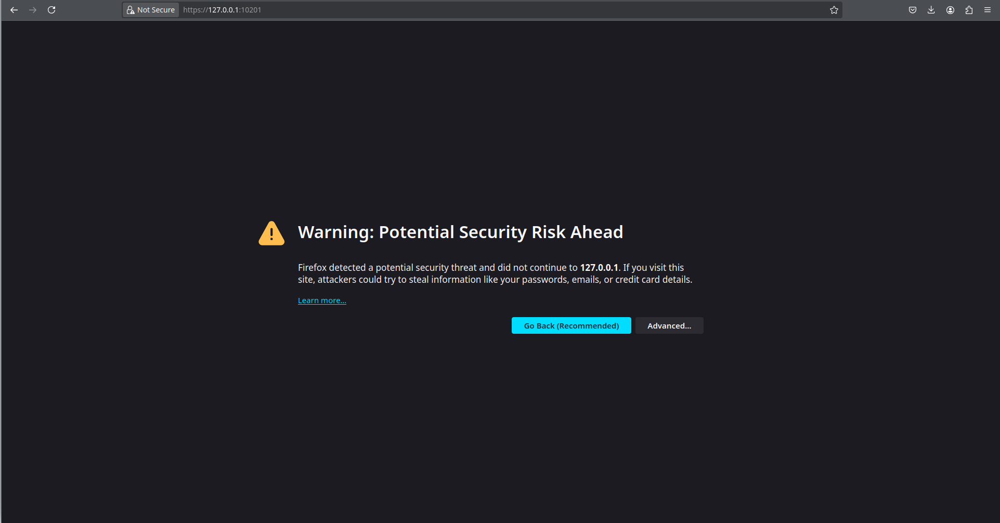
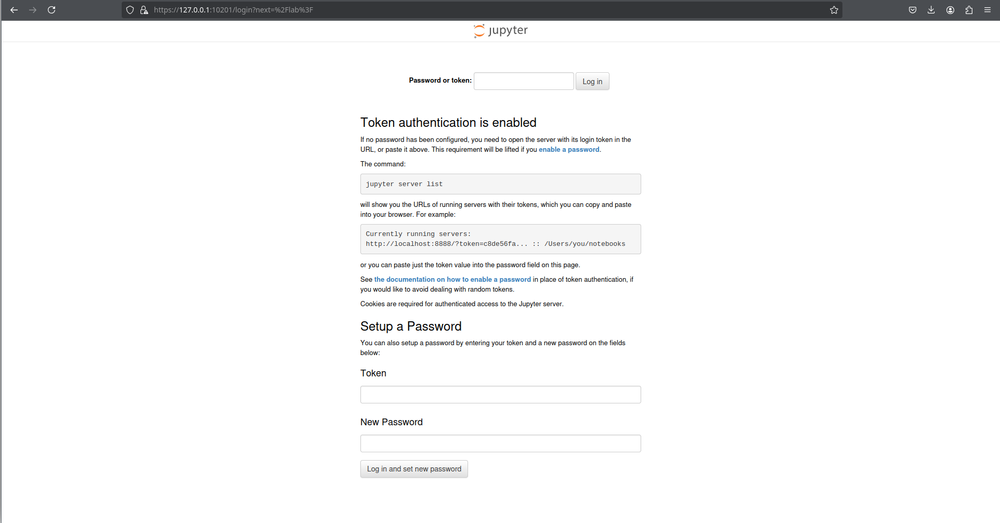
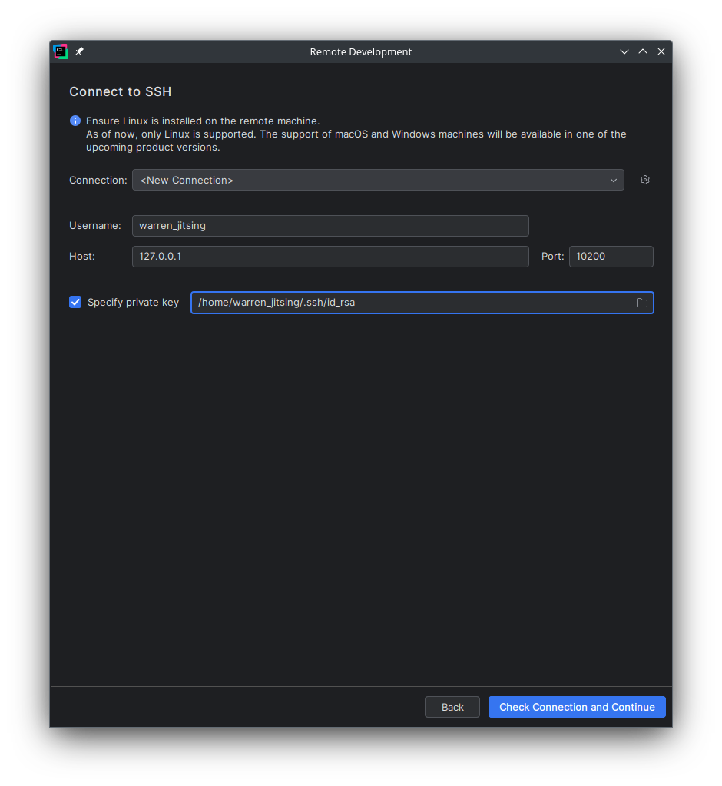
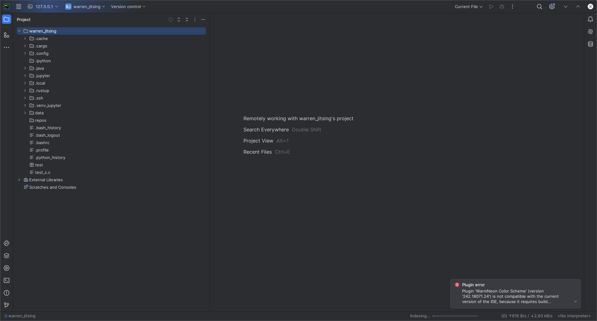

# Interactive Version & Source Code

For the optimal reading experience and access to the complete, version-controlled source code, the definitive version of this article is hosted on GitHub. I highly recommend following along there:

[Docker Development Environment with GCC, Python, Rust](https://github.com/warrenjitsing/LinkedInArticles/tree/main/articles/0002_docker_dev_environment)

This repository also includes an AI assistant bootloader in the `ai.md` file. By providing this bootloader and the article's contents to a capable AI assistant, you can transform this guide into a dynamic, interactive learning tool and project builder. Due to the large context required, a pro-tier subscription to your chosen AI service (such as ChatGPT Plus or Gemini Advanced) is highly recommended for the best results.


# Introduction

Most development environments are a compromise—a fragile mix of system packages, conflicting dependencies, and the classic "it works on my machine" problem. Docker offers a solution, but often introduces its own headaches with file permissions, monolithic images, and toolchains that are difficult to customize. This guide rejects that compromise.

We'll use a **first-principles approach** to build a professional, multi-language (C, C++, Python, Rust) development environment from the ground up. You'll learn *why* containers are fundamentally more efficient than traditional virtual machines before we construct a `Dockerfile` that gives you:

- A **permission-safe architecture** that works seamlessly with your local files.
- **Custom-built, modern toolchains** compiled from source.
- Integrated **JupyterLab** and **SSH access** for truly remote-capable development.

By the end, you won't just have a powerful, reproducible environment; you'll have the knowledge to build and customize any development container you'll ever need.

## A Quick Note on Operating Systems

A quick heads-up: This guide, and my sanity, are built on a **Debian-based Linux system** (Debian 12, to be exact). All commands and paths will reflect that native environment.

For those of you navigating the Windows landscape, your journey requires a preliminary side-quest into the **Windows Subsystem for Linux (WSL)**. In essence, you'll be running a Linux virtual machine to make all this work. Your quest begins with enabling virtualization in your computer's BIOS and a chat with your command line (`wsl --install`).

Why don't I provide the step-by-step? Honestly, I'd love to help, but I haven't willingly booted into Windows since they introduced Clippy, and I'd like to keep that streak alive. Godspeed.

On the bright side, you can feed the interactive version of this article to the modern-day Clippy (like ChatGPT or Gemini) and have it guide you through the Windows-specific setup. You'll want to get this running, as I'll be writing all my future articles from inside this environment - making them modular by default.


# Foundations

## A Primer on Isolation

Every developer knows the five most dreaded words in software engineering: **"but it works on my machine."** It’s a phrase that signals a project is about to derail, bogged down by an environment that is unstable, inconsistent, and impossible to reproduce.

Your local machine is often a chaotic battlefield of competing dependencies. Project A demands Python 3.9, while Project B will only run on 3.12. A system library gets upgraded for one task, only to break another. Onboarding a new developer turns into a full-day archeological dig through outdated setup scripts and tribal knowledge just to get them to a point where they can compile the code.

This chaos is the enemy of professional software development. The goal, and the problem we are solving with this guide, is to create a development environment that is perfectly **clean, reproducible, and portable**. We need a setup that is identical for every developer on the team and, most importantly, **identical to the production environment** where the code will ultimately run. This is the fundamental "why" behind environmental isolation.

---

## Traditional Virtualization (The Heavyweight Approach)

For decades, the standard, brute-force solution to the isolation problem has been **traditional virtualization**. This approach uses a piece of software called a **hypervisor** to emulate a full set of physical hardware—a virtual CPU, RAM, storage, and network card—allowing you to run a Virtual Machine (VM).

The key detail here is that every VM includes a **complete guest operating system**, from the kernel all the way up to its system libraries. This is why the best analogy for a VM is that you are running a **complete, separate computer on your computer**. And just like a physical machine, it needs to boot its own OS, which is why VMs are notoriously slow to start and consume large, fixed chunks of your system's RAM and disk space.

On Linux, this is typically handled by a powerful combination of **KVM (Kernel-based Virtual Machine)**, a feature that turns the Linux kernel itself into a high-performance hypervisor, and tools like **QEMU** for managing the hardware emulation. It's a robust and powerful system, but it's often massive overkill for development tasks.

## Containerization (The Lightweight Approach)

If a VM is a separate house, a container is a private apartment inside a shared building. This is the paradigm shift of **OS-level virtualization**. Instead of emulating an entire hardware stack, containers are just isolated processes that run directly on the host machine's OS. The revolutionary and incredibly efficient concept is that all containers **share the host machine's kernel**.

This is made possible by two powerful, first-principles features built into the Linux kernel itself:
-   **Namespaces** provide isolation. They act as virtual walls that control what each process can see—its own filesystem, network stack, and process IDs—making it feel like it's the only thing on the machine.
-   **Control Groups (cgroups)** provide resource limiting. They act like utility meters, controlling exactly how much CPU and RAM each container is allowed to consume.

Expanding our analogy, the host OS and its kernel are the apartment building's foundation and shared infrastructure (plumbing, electricity). Each container is a private apartment. **Namespaces** are the walls and locked doors that ensure you can't see into your neighbor's space, and **cgroups** are the circuit breakers preventing you from hogging all the power.

Because there's no guest OS to boot and no hardware to emulate, the results are staggering. Containers launch in **milliseconds**, not minutes, and their resource overhead is minimal.

## Why We Choose Docker

With all this powerful kernel technology, a question arises: where does Docker fit in? It's a crucial point that Docker **did not invent the container**. Linux container technologies like LXC existed for years, but they were complex and largely reserved for system administration wizards.

Docker's true innovation wasn't the technology itself, but the brilliant **usability and developer experience** it built on top of it. It created a cohesive ecosystem that made containers accessible to everyone through three key components:

- A simple, text-based **`Dockerfile`** that provides a human-readable blueprint for building images.
- The **Docker Engine** that provides a simple, powerful command-line interface to build, ship, and run those images.
- The **Docker Hub**, which acts as a massive public library for sharing and downloading pre-built images.

Together, these tools give developers exactly what we need. They harness the raw **speed** and **efficiency** of OS-level virtualization and package it with a guarantee of **unparalleled reproducibility**. This is the combination that finally, decisively, solves the "it works on my machine" problem for good.


# Blueprint

## A Polyglot, Custom-Built Toolchain

A professional development environment shouldn't be limited by whatever outdated packages your base operating system happens to provide. We are rejecting stale, pre-packaged binaries in favor of a versatile, high-performance toolkit compiled directly from source. This approach gives us maximum control, the latest features, and an environment tailored for serious, forward-looking engineering.

The foundation of our toolkit will be **GCC 15.2**, the latest C/C++ compiler, which we'll build ourselves. This guarantees immediate access to cutting-edge language features and optimizations, essential for high-performance computing. For Python, we'll install multiple sandboxed versions—**3.11.13** and **3.12.11**—to mirror real-world production targets. Crucially, we will also build the experimental **`nogil` (free-threaded) version of Python 3.13.7**, allowing us to explore true multi-threaded parallelism for CPU-bound tasks. Finally, we'll round out our environment with the latest stable **Rust** toolchain (**1.89.0**) via `rustup`, giving us a first-class language for building memory-safe, concurrent, and efficient systems-level code.

## A Permission-Safe Architecture

Anyone who has used Docker for local development has hit the wall: the dreaded **file permission error**. You mount a local source code directory, the container generates a file as its default `root` user, and suddenly back on your host machine, you need `sudo` just to edit your own code. This frustrating cycle of running `sudo chown` happens because the user ID inside the container (e.g., `root` with UID 0) doesn't match your user ID on the host (e.g., `warren` with UID 1000). At the end of the day, the Linux kernel only cares about these numeric IDs.

This guide rejects that broken workflow. Our goal is to create a seamless experience where the container feels like a native extension of your filesystem. We achieve this with a simple but powerful architectural choice: we will dynamically **match the container user's User ID (UID) and Group ID (GID) to your host user's**.

By passing your host UID and GID as build arguments into the `Dockerfile`, we will create a user inside the container that is, from the kernel's perspective, identical to you. The result is a permission-safe environment that just works. Files created on the host are perfectly writable by the container, and files generated in the container are owned by you on the host. This eliminates clumsy workarounds and is a critical feature for any professional development setup.

## An Integrated Web IDE and Notebook

Modern development is more than just command-line compilation; a truly productive workflow requires a space for interactive computing, data exploration, and rapid prototyping. To serve this need, our environment includes a fully configured **JupyterLab** server, elevating it from a simple container to a comprehensive, remote-capable workstation.

Accessible directly from your local web browser, JupyterLab provides the industry-standard interface for everything from quick experiments to long-running data science tasks. It's the perfect tool for exploratory data analysis, allowing you to run code snippets in our custom Python environments, visualize results, and document your thought process in a single, shareable notebook. Because it's web-based, you can access the full computational power of your container from any machine, effectively turning a lightweight laptop into a heavyweight development powerhouse.

## Seamless Git and SSH Integration

One of the common friction points with containerized development is securely interacting with remote services, particularly private Git repositories. The typical workaround involves cumbersome password prompts or insecure key management. We're eliminating that entirely.

Our environment is designed for **seamless, secure integration** with your existing workflow. The container will be configured to automatically and securely **leverage your host machine's SSH keys**. This isn't just for `git pull` and `git push` to services like GitHub or GitLab, enabling version control without friction. It also enables **remote development through powerful IDEs** like VS Code, PyCharm, CLion, or RustRover. You'll be able to attach these tools directly to your running container, getting the full IDE experience while all your heavy computation and custom toolchains run isolated and consistently within the container. This bridges the gap between local convenience and containerized power.

# Environment Setup

This is where our blueprint becomes reality. The heart of our environment is the `Dockerfile`, a text file that contains the step-by-step recipe for building our container image. Before we dive into our final file, let's quickly cover the main commands—or "directives"—that form the language of every `Dockerfile`.

## A Primer on Dockerfile Directives

Think of these directives as the verbs in our recipe. Understanding them is the key to reading and writing any `Dockerfile`.

-   **FROM**: Every `Dockerfile` must start with this. It declares the **base image** that we'll build on top of, like choosing the foundation for a house. Our foundation will be `debian:12`.
-   **LABEL**: Adds **metadata** to an image, such as the author or version. It's a simple but important practice for organizing and documenting your work.
-   **ARG**: Defines a **build-time variable**. These are temporary variables that only exist while the image is being built. They are absolutely critical for our setup, as we'll use them to pass your host user's unique UID and GID into the build process to create our permission-safe user.
-   **RUN**: The **workhorse** of the `Dockerfile`. It executes any command in a new layer on top of the current image and commits the results. We'll use this extensively for installing packages and compiling our toolchains from source.
-   **COPY**: This instruction copies new files or directories from your host machine (the build context) into the filesystem of the container.
-   **USER**, **WORKDIR**, and **EXPOSE**: These are key configuration directives. `USER` sets the default user for all subsequent `RUN`, `CMD`, and `ENTRYPOINT` instructions. `WORKDIR` sets the working directory for those commands. `EXPOSE` documents which network ports the container is configured to listen on at runtime.
-   **ENTRYPOINT**: Specifies the main command that will be executed when a container is started from the image. This is the primary purpose of the container.

## Foundation and Permission-Safe User Setup

Every `Dockerfile` starts with a foundation. We'll begin by defining our base image, setting up all the build-time arguments for software versioning and user configuration, and then creating the special user that will permanently solve the file permission problems we outlined earlier.

Here is the first block of our `Dockerfile`:

```dockerfile
FROM debian:12
LABEL authors="warren_jitsing"

# Software versions and user details passed in from the build script
ARG py311="3.11.13"
ARG py312="3.12.11"
ARG py313="3.13.7"
ARG gcc15="15.2.0"
ARG USERNAME
ARG USER_UID
ARG USER_GID
ARG SSH_DIR

# Dependencies in next section installed here

# Create a user, enable SSH pubkey auth, and grant sudo privileges
RUN groupadd --gid $USER_GID $USERNAME \
    && useradd --uid $USER_UID --gid $USER_GID -m $USERNAME \
    && sed -i "s/#PubkeyAuthentication yes/PubkeyAuthentication yes/g" /etc/ssh/sshd_config \
    && echo $USERNAME ALL=\(root\) NOPASSWD:ALL > /etc/sudoers.d/$USERNAME \
    && chmod 0440 /etc/sudoers.d/$USERNAME \
    && echo 'export GPG_TTY=$(tty)' >> /home/$USERNAME/.bashrc
```

We start with `FROM debian:12`, choosing the latest stable release of Debian ("Bookworm") as our rock-solid and minimal base. After a quick `LABEL`, we declare all of our build-time arguments using `ARG`. This centralizes our software versions and, most importantly, defines the placeholders for **`USERNAME`**, **`USER_UID`**, and **`USER_GID`** that are the key to our permission-safe architecture.

The `RUN` command is now a multi-stage process, chained together with `&&` to run within a single image layer for efficiency:

1.  First, it uses `groupadd` and `useradd` with the passed-in `UID` and `GID` to create a user inside the container that perfectly mirrors your user on the host. This is the core of our permission-safe setup.
2.  Next, it enables public key authentication in the SSH server's configuration (`sshd_config`), a crucial step for secure, key-based remote access.
3.  Finally, it grants our new user passwordless `sudo` privileges by creating a special configuration file in `/etc/sudoers.d/` and setting its permissions, ensuring we can perform administrative tasks when needed without friction.

## System Dependencies

With our user configured, the next step is to install all the system-level dependencies we'll need. To do this as efficiently as possible, we'll perform all our package management operations within a single, large `RUN` command.

```dockerfile
RUN apt update \
    && apt install -y \
        sudo openssh-client openssh-server nano procps less build-essential cmake curl wget git \
        pkg-config zlib1g-dev libncurses5-dev libgdbm-dev libnss3-dev libssl-dev libreadline-dev \
        libffi-dev libsqlite3-dev wget curl pkg-config libbz2-dev libgdbm-compat-dev liblzma-dev \
        lzma uuid-dev python3-tk ca-certificates openssl ca-certificates fontconfig git-lfs \
        patch tzdata netbase iproute2 python3-full python3-dev python3-pip wget libzstd-dev \
        libzstd1 flex libfl-dev libfl2 m4 gnupg2 tmux \
    && apt upgrade -y \
    && apt-get autoremove -y \
    && rm -rf /var/lib/apt/lists/* \
    && apt-get purge -y --auto-remove -o APT::AutoRemove::RecommendsImportant=false
```

This block might look intimidating, but it's a highly optimized pattern. Every `RUN` instruction creates a new layer in the final image. By chaining all our commands together with `&&`, we ensure that everything—from updating the package index to installing tools and cleaning up afterwards—happens within a **single layer**. This is a critical best practice that prevents temporary files from being permanently baked into the image, keeping it as lean as possible.

The command itself has three main stages:

1.  **Installation**: The `apt install -y` command pulls in a wide array of tools. This includes essentials for **compiling software** (`build-essential`, `cmake`), the many `-dev` libraries required to build Python from source (like `libssl-dev` and `libffi-dev`), and core **system utilities** like `git`, `sudo`, and the `openssh-server`.
2.  **Upgrade**: We then run `apt upgrade -y` to ensure all packages from the base image are patched to their latest versions for security.
3.  **Cleanup**: Finally, the `autoremove`, `purge`, and `rm` commands meticulously clean up everything we no longer need. The `rm -rf /var/lib/apt/lists/*` is the most important of these, as it deletes the package index and saves a significant amount of space in our final image.


### A Closer Look at Our System Packages

For those curious about the specifics, the large `apt install` command can be broken down into four main themes. This is a look at the most important packages and the role they play in our environment.

-   **Compiling GCC and C/C++ Software**
    This group contains the fundamental tools for building software from source.
    -   `build-essential`: Installs the core necessities, including `make`, `gcc`, and `g++`.
    -   `cmake`: A modern, cross-platform build system generator required by many complex projects.
    -   `flex`, `libfl-dev`, `m4`, `libzstd-dev`: Specific dependencies required to compile the GCC toolchain itself.

-   **Compiling Python from Source**
    Python relies on numerous underlying C libraries. To build it from source, we need the development headers (`-dev` packages) for these libraries.
    -   `libssl-dev`: For SSL/TLS support, essential for `https` requests and `pip`.
    -   `libffi-dev`: Allows Python to call functions in C libraries, a key part of its ecosystem.
    -   `libsqlite3-dev`: Required to build the built-in `sqlite3` module.
    -   `zlib1g-dev`, `libbz2-dev`, `liblzma-dev`: For various data compression algorithms used by the standard library.
    -   `python3-tk`: For the `tkinter` GUI library, often used in data science contexts.

-   **SSH Server and Git**
    These packages enable remote access and professional version control workflows.
    -   `openssh-server` and `openssh-client`: The core components that allow us to connect remotely to the container via SSH for IDE integration.
    -   `git`, `git-lfs` and `gnupg2`: For all version control operations, including support for large file storage. `gnupg2` allows us to sign our commits - an often overlooked security feature. The variable GPG_TTY added to our bashrc allows us to enter our passwords for our git signing keys within the container's text interface. 

-   **General Utilities**
    A collection of essential command-line tools for a functional and user-friendly Linux environment.
    -   `sudo`: Allows our non-root user to perform specific, approved administrative tasks.
    -   `curl` and `wget`: Standard tools for downloading files from the internet.
    -   `nano` and `less`: A basic text editor and a file pager for quick inspections.
    -   `procps` and `iproute2`: For inspecting running processes and managing network configurations inside the container.
    -   `tmux`: A terminal multiplexer. Allows us to manage multiple terminal sessions and run background programs.


## Building the C/C++ Toolchain

Our first major task is to build a state-of-the-art C/C++ compiler. Despite the rise of newer languages, C and C++ remain the undisputed kings of performance-critical domains like quantitative finance, game engines, and operating systems. By building the latest **GCC** from source, we gain immediate access to cutting-edge language standards (like C++26) and processor-specific optimizations that pre-packaged versions in system repositories might not see for years.

```dockerfile
RUN mkdir ~/deps && \
    cd ~/deps && \
    git clone --depth=1 -b releases/gcc-$gcc15 https://github.com/gcc-mirror/gcc.git && \
    cd gcc && \
    ./contrib/download_prerequisites && \
    mkdir build && cd build && \
    ../configure --disable-multilib --enable-languages=c,c++ && make -j 12 && make install  && \
    cd && rm -rf deps/gcc && \
    echo "export CC=/usr/local/bin/gcc" >> ~/.bashrc  && \
    echo "export CXX=/usr/local/bin/g++" >> ~/.bashrc  && \
    echo "export CC=/usr/local/bin/gcc" >> /home/$USERNAME/.bashrc  && \
    echo "export CXX=/usr/local/bin/g++" >> /home/$USERNAME/.bashrc
```

This `RUN` block is the most complex so far. After setting up `sudo` privileges for our user and installing a few more dependencies, it follows the classic Unix-style pattern for building from source:

1.  First, we **clone** the GCC source code for our target version into a temporary `deps` directory.
2.  The `download_prerequisites` script conveniently fetches other libraries that GCC itself depends on, like MPFR and GMP.
3.  The `configure` script inspects our system and prepares the Makefiles for the build. We use `--disable-multilib` to avoid building 32-bit libraries, keeping our environment lean.
4.  `make -j 12` is the main event: the parallel compilation process across 12 threads. This is the most time-consuming step in our `Dockerfile`. Note, if you run out of RAM, please reduce the number of threads (or increase them on a powerful machine).
5.  `make install` copies the finished compiler binaries and libraries into standard locations like `/usr/local/bin`.

Finally, we perform two crucial cleanup steps: we **remove the source code directory** to keep our final image size down, and we update `.bashrc` to **set our new compiler as the default** for the user's shell sessions as well as for the root user. This is a lengthy but vital process for creating a truly professional C++ environment and ensures we compile our Python versions with the latest version of GCC.

## Building the Python Runtimes

Python's versatility has made it a dominant force in data science, machine learning, and web development. However, for CPU-bound concurrent tasks, it has a well-known limitation: the **Global Interpreter Lock (GIL)**, a mutex that prevents multiple native threads from executing Python bytecodes at the same time. To address this, our environment will not only include standard Python versions for maximum compatibility but also the exciting experimental **`nogil` build**, which removes the GIL and opens the door to true multi-threaded parallelism.

```dockerfile
RUN for version in $py311 $py312 $py313; do \
        echo "--- Building Python version ${version} ---"; \
        wget https://github.com/python/cpython/archive/refs/tags/v${version}.tar.gz; \
        tar -xzf v${version}.tar.gz; \
        cd cpython-${version}; \
        \
        CONFIGURE_FLAGS="--enable-optimizations --enable-loadable-sqlite-extensions --with-lto=full"; \
        if [ "$version" = "$py313" ]; then \
            echo "--- Adding --disable-gil flag for nogil build ---"; \
            CONFIGURE_FLAGS="$CONFIGURE_FLAGS --disable-gil"; \
        fi; \
        \
        ./configure $CONFIGURE_FLAGS; \
        make -j 12; \
        sudo make altinstall; \
        cd ..; \
    done && \
    rm -rf v*.tar.gz && \
    rm -rf cpython-*
```

To build our three separate Python versions without repeating ourselves, we use an efficient `for` loop directly within our `RUN` command. This loop iterates through the versions we defined as `ARG`s and performs the same build process for each, starting with `wget` to download the source code and `tar` to extract it.

The most clever part is the conditional logic that customizes the `configure` flags:

```shell
if [ "$version" = "$py313" ]; then \
    CONFIGURE_FLAGS="$CONFIGURE_FLAGS --disable-gil"; \
fi;
```

This `if` statement checks if the current version being built is our target `nogil` version. If it is, it dynamically adds the **`--disable-gil`** flag to the `./configure` command, fundamentally changing how that specific version is compiled while leaving the others as standard builds.

Finally, we use `sudo make altinstall` instead of the standard `make install`. This is a critical distinction: `altinstall` installs the binaries with version numbers (e.g., `python3.11`, `python3.13`) and avoids overwriting the system's default `/usr/bin/python3`, allowing all our custom versions to coexist peacefully. After the loop completes, a final cleanup step removes the downloaded archives and source code to keep our image lean.


## Installing the Rust Toolchain

Rounding out our polyglot environment is Rust, the modern answer to the age-old trade-off between performance and safety. For decades, developers often had to choose between the raw speed of C++ and the safety of managed languages. Rust changes the game by providing C++-level performance while guaranteeing memory safety at compile time. This is enforced by its famous **"borrow checker,"** a static analyzer that eliminates entire classes of bugs like null pointer dereferences and data races before your code even runs, making it a go-to choice for building reliable and concurrent systems.

```dockerfile
USER $USERNAME
WORKDIR /home/$USERNAME

RUN curl https://sh.rustup.rs -sSf | sh -s -- -y
```

After the complex, multi-step builds for GCC and Python, installing Rust is refreshingly simple. We first switch from `root` to our newly created non-root user with the `USER` directive and set their home directory as our `WORKDIR`.

The installation itself is a single `RUN` command that downloads and executes the official `rustup` installation script. This streamlined process is a deliberate design choice by the Rust community. **`rustup` is the official, best-practice tool** for installing and managing Rust versions, the compiler (`rustc`), the build system (`cargo`), and more. This officially supported, all-in-one approach makes adding Rust to any environment a seamless and reliable process.


## Installing JupyterLab

A modern development workflow isn't just about compiling code; it requires tools for interactivity. To that end, we'll install the **JupyterLab** web IDE for data exploration. We will use tmux in our entrypoint script later to run the Jupyter server as a persistent, background service, a common pattern for managing long-running applications in a container.

To keep our environment clean, JupyterLab will be installed into its own dedicated virtual environment using our custom-built Python 3.12.

```dockerfile
RUN python3.12 -m venv /home/$USERNAME/.venv_jupyter && \
    . /home/$USERNAME/.venv_jupyter/bin/activate && \
    python3 -m pip install --no-cache-dir jupyterlab
```

This `RUN` command first creates the virtual environment. Then, the `. /home/$USERNAME/.venv_jupyter/bin/activate` command (where `.` is a synonym for `source`) activates that environment, modifying the `PATH` variable for the remainder of this command's execution. This is what allows us to then simply call `python3 -m pip install`, which now correctly points to the Python interpreter inside our new venv, ensuring JupyterLab and its dependencies are installed in an isolated location. As before, `--no-cache-dir` is used as a best practice to minimize the final image size.

## Configuring SSH and Git Integration

Securely interacting with services like Git from within a container is a common friction point. Our goal is to make this seamless, allowing you to use your existing SSH keys for both version control and remote IDE connections without any clumsy workarounds.

First, we securely copy the host's entire `.ssh` directory into the container.

```dockerfile
COPY --chown=$USERNAME:$USERNAME --chmod=700 $SSH_DIR /home/$USERNAME/.ssh
```

We use the `--chown` flag, which is critical for security. It performs two actions in one atomic step: it copies the files and sets the ownership to our non-root container user. This ensures your sensitive private keys are never mishandled or left with incorrect permissions inside the image.

Next, we configure how these keys will be used both for connecting *into* the container for remote development and connecting *from* the container to outside services like Git.

```dockerfile
# We use the public key to allow SSH connections into the container
RUN cat /home/$USERNAME/.ssh/id_rsa.pub > /home/$USERNAME/.ssh/authorized_keys

# We create a config file to simplify connecting to external git servers
RUN printf "Host github\n\
    HostName github.com\n\
    IdentityFile ~/.ssh/id_rsa\n\
    StrictHostKeyChecking no\n\
\n\
Host your-private-gitlab\n\
    HostName git.example.com\n\
    Port 2222\n\
    IdentityFile ~/.ssh/id_rsa\n\
    StrictHostKeyChecking no\n\
" > /home/$USERNAME/.ssh/config
```

This block performs two distinct tasks:

1.  It creates an `authorized_keys` file from your public key. This is the crucial step that authorizes your host machine to connect **into** the container via SSH, which is how remote IDEs like VS Code, CLion, or PyCharm work.
2.  It creates a local SSH `config` file inside the container to define connection aliases. The `Host` directive defines a short, convenient alias (like **`github`** or **`your-private-gitlab`**) that we can use in place of the full connection details. This is especially useful for self-hosted version control systems that may run on non-standard ports. Our `your-private-gitlab` alias, for example, maps to the real hostname `git.example.com` and a custom port `2222`. This allows you to use clean, simple commands like `git clone git@your-private-gitlab:my-group/my-repo.git` without having to remember the specific server details.


## Setting the Entrypoint and Exposing Ports

The final steps in our `Dockerfile` define the container's runtime behavior. We'll copy in our startup script, document the network ports, and set the default command that runs when the container launches.

```dockerfile
COPY --chown=$USERNAME:$USERNAME --chmod=755 ./entrypoint.sh /entrypoint.sh

EXPOSE 22 8888
ENTRYPOINT ["/entrypoint.sh"]
```

First, we `COPY` our `entrypoint.sh` script into the container, using `--chmod=755` to ensure it's executable. Next, `EXPOSE 22 8888` serves as important documentation. It doesn't publish the ports to the host, but it signals to the user and other tools that the container is designed to provide services on the standard SSH port (22) and the default Jupyter port (8888). Finally, the crucial `ENTRYPOINT` directive sets our script as the primary command to be executed every time a container is started from this image.

### The Entrypoint Script

Our `entrypoint.sh` script is a simple startup orchestrator. When the container runs, this script performs several convenience and setup tasks before giving you control of the terminal.

```shell
#!/bin/sh
sudo service ssh restart

# Check for GPG key and gitconfig on the persistent data volume
if [ -e data/private.pgp ]; then
    gpg --import data/private.pgp
fi

if [ -e data/.gitconfig ]; then
    cp data/.gitconfig ~/.gitconfig
fi

# Generate a self-signed TLS certificate for JupyterLab if one doesn't exist
if [ ! -f "data/cert.pem" ] || [ ! -f "data/key.pem" ]; then
    echo "--- Generating self-signed TLS certificate for JupyterLab ---"
    openssl req -x509 \
      -nodes \
      -newkey rsa:4096 \
      -keyout data/key.pem \
      -out data/cert.pem \
      -sha256 \
      -days 365 \
      -subj '/CN=localhost'
fi

# Activate venv and start JupyterLab in a detached tmux session
. .venv_jupyter/bin/activate
tmux new -d -s jupyterlab "jupyter lab --ip=0.0.0.0 --port=8888 --no-browser --certfile=data/cert.pem --keyfile=data/key.pem"

bash
```

The script's logic is as follows:

1.  It first ensures the **SSH service is running** so you can connect with remote IDEs.
2.  It then performs convenience checks for a GPG key and a `.gitconfig` file on the persistent data volume, importing and copying them if they exist to maintain your identity across rebuilds.
3.  Next, it checks for the existence of a TLS certificate. If `cert.pem` and `key.pem` are not found in the `data/` directory, it generates a new **self-signed certificate** using `openssl`. This allows the JupyterLab server to run over a secure `https` connection, which is a critical security best practice.
4.  Finally, it activates our Jupyter virtual environment and uses **`tmux`** to start the JupyterLab server. The `tmux new -d -s jupyterlab "..."` command creates a new, **detached** session named `jupyterlab` and runs the server in the background. This ensures the server keeps running even after we connect and disconnect from the main terminal. The server is configured to use our newly generated TLS certificate.
5.  The script finishes with starting an interactive `bash` shell.

---

# Orchestrating with Shell Scripts

We've just completed a deep dive into the `Dockerfile`, the architectural blueprint for our container image. However, a blueprint alone isn't a user-friendly tool. It has dynamic parts, like our user ID arguments, but it has no way of knowing the specifics of your host machine. Furthermore, the `docker build` and `docker run` commands required to operate it are long and cumbersome to type repeatedly.

To solve this, we'll create two simple but powerful shell scripts. Think of the `Dockerfile` as the detailed schematic for a high-performance engine; these scripts are the ignition key and the start button. They provide a clean, simple interface that handles all the complex, host-specific, and repetitive tasks for us.

Before we deconstruct the scripts themselves, let's cover the one-time prerequisite: getting the Docker Engine running on your machine.

---

## Setting up Docker

### For Linux (Debian-based) Users

The following commands are based on the official Docker documentation and provide the most robust method for setting up the Docker Engine from Docker's official `apt` repository.

**1. Uninstall Older Versions**

First, it's a good practice to remove any older or conflicting Docker packages that may have been installed from unofficial repositories.

```shell
for pkg in docker.io docker-doc docker-compose podman-docker containerd runc; do sudo apt-get remove $pkg; done
```

**2. Set Up Docker's Official Repository**

Next, we configure `apt` to trust and use Docker's repository. This ensures we install the official, up-to-date version. This is a two-step process: first we add Docker's official GPG key for security, then we add the repository itself.

```shell
# Add Docker's official GPG key:
sudo apt-get update
sudo apt-get install -y ca-certificates curl
sudo install -m 0755 -d /etc/apt/keyrings
sudo curl -fsSL https://download.docker.com/linux/debian/gpg -o /etc/apt/keyrings/docker.asc
sudo chmod a+r /etc/apt/keyrings/docker.asc

# Add the repository to Apt sources:
echo \
  "deb [arch=$(dpkg --print-architecture) signed-by=/etc/apt/keyrings/docker.asc] https://download.docker.com/linux/debian \
  $(. /etc/os-release && echo "$VERSION_CODENAME") stable" | \
  sudo tee /etc/apt/sources.list.d/docker.list > /dev/null
sudo apt-get update
```

**3. Install the Docker Engine**

With the repository configured, we can now install the latest version of the Docker Engine, CLI, and related components.

```shell
sudo apt-get install -y docker-ce docker-ce-cli containerd.io docker-buildx-plugin docker-compose-plugin
```

**4. Verify the Installation**

To verify that the installation was successful, run the simple `hello-world` image. This command will download a tiny test image, run it in a container, and print a confirmation message if everything is working correctly.

```shell
sudo docker run hello-world
```

**5. Post-Installation Configuration (Crucial Step)**

By default, you must use `sudo` to run Docker commands. To manage Docker as a non-root user, you need to add your user to the `docker` group.

```shell
sudo usermod -aG docker $USER
```

**Important**: For this group membership change to take effect, you must start a new shell session. The easiest way to ensure this is to either **log out and log back in**, or simply **reboot your computer**.


### For Windows Users

**For Windows users, this is where your setup path diverges significantly.** Our scripts are designed for a native Linux environment, which you will run via the Windows Subsystem for Linux (WSL 2).

The recommended approach is to install Docker Desktop for Windows, which is designed to integrate seamlessly with WSL 2. You can find the official guide here: [Install Docker Desktop on Windows](https://docs.docker.com/desktop/install/windows-install/).

A few key points to remember during this process:
* You may need to **enable virtualization** (often called VT-x or AMD-V) in your computer's BIOS or UEFI settings.
* You will need to install WSL 2 itself, which can often be done with the `wsl --install` command in an administrative PowerShell terminal.
* From this point forward, all commands in this guide, including running our shell scripts, must be executed from within your WSL 2 terminal (e.g., the Ubuntu terminal), not from PowerShell or the standard Windows Command Prompt. If something doesn't work, please get Clippy-ng to help you.


## The Build Script: `build-dev.sh`

The `build-dev.sh` script is the "smart" front-end for our `docker build` command. Its primary job is to act as an orchestrator, gathering dynamic, host-specific information and securely injecting it into the image build process. This prevents us from having to type out a long, complex command every time we want to rebuild our environment.

Here is the full script:

```shell
#!/usr/bin/env bash

USERNAME="$USER"
USER_ID=$(id -u)
USER_GID=$(id -g)

# Define the directory on your host containing the SSH keys
# you want to pass to the container.
# This can be your default ~/.ssh or a custom directory.
SSH_DIR_HOST=~/.ssh

# We copy the SSH directory into the current directory to include it in the
# build context, then clean it up afterwards.
cp -r $SSH_DIR_HOST .
SSH_DIR_CONTEXT=$(basename $SSH_DIR_HOST)

docker build --build-arg SSH_DIR="$SSH_DIR_CONTEXT" \
  --build-arg USERNAME="$USERNAME" \
  --build-arg USER_UID="$USER_ID" \
  --build-arg USER_GID="$USER_GID" \
  -f Dockerfile -t dev-container:latest .

# Clean up the copied SSH directory.
rm -rf $SSH_DIR_CONTEXT
```

Let's deconstruct its key responsibilities.

-----

### Gathering Host Context

The first three lines capture the context of the user running the script:

```shell
USERNAME="$USER"
USER_ID=$(id -u)
USER_GID=$(id -g)
```

These commands gather your username, user ID (`UID`), and group ID (`GID`). As we've discussed, passing these into the `Dockerfile` via `--build-arg` is the core mechanism that enables our **permission-safe architecture**.

-----

### Handling SSH Keys Securely

The next block handles the SSH keys needed for `git` and remote IDE access.

```shell
SSH_DIR_HOST=~/.ssh

cp -r $SSH_DIR_HOST .
SSH_DIR_CONTEXT=$(basename $SSH_DIR_HOST)
# ... docker build command uses $SSH_DIR_CONTEXT ...
rm -rf $SSH_DIR_CONTEXT
```

We first define a variable, `SSH_DIR_HOST`, which you can change if you want to use a specific set of keys for this container instead of your default `~/.ssh` directory. For example, you could create a dedicated key pair for this environment:

```shell
ssh-keygen -f ~/data/.ssh/example_dev_key
```

You would then set `SSH_DIR_HOST` to `~/data/.ssh`. Note that our `Dockerfile` expects a public key named `id_rsa.pub` by default to create the `authorized_keys` file, but this can be easily adapted for other key names or types like `id_ecdsa`.

The script then **copies** this directory into the current location before the build and removes it after. This is a deliberate choice. While we could have used a volume mount, copying the directory ensures that the `Dockerfile` build process cannot accidentally modify the original files on your host system.

-----

### Overriding Default Versions (Advanced)

Finally, the `docker build` command itself uses the `--build-arg` flag to pass all this information into the build. This flag is very flexible. In addition to the user and SSH details, you can use it to override any `ARG` defined in the `Dockerfile`, such as the default software versions.

For example, if you wanted to build the environment with a different version of GCC, you could run the build command like this:

```shell
docker build --build-arg gcc15="15.1.0" \
  # ... other build args ...
  -f Dockerfile -t biquant:latest .
```

This gives you full, granular control over the toolchain versions in your environment without ever needing to modify the `Dockerfile` itself.

### Docker Caching Behaviour

One of Docker's most powerful and important features is its **build cache**. Understanding how it works is the key to efficient development and fast iteration times.

Every instruction in a `Dockerfile` (like `RUN`, `COPY`, `ADD`) creates a new, immutable layer in the image. When you run `docker build`, Docker steps through your `Dockerfile` instruction by instruction. For each step, it checks if it already has a cached layer from a previous build that it can reuse.

The rule is simple but critical: as soon as Docker encounters an instruction that has changed since the last build, it must rebuild that layer **and every subsequent layer** from scratch.

This is why the structure of our `Dockerfile` is so important. We perform the slowest, most time-consuming tasks—like compiling GCC and the Python runtimes—as early as possible. As long as those lines don't change, Docker will use the cached layers from the first build. This means you won't have to go through the multi-hour compilation process every single time you invoke the build script.

If you want to customize the environment further by installing a new tool, you can add a new `RUN` command just before the `ENTRYPOINT` directive. By placing it at the end, Docker will reuse all the preceding cached layers, and your change will be applied in seconds instead of hours.

## The Run Script: `dev-container.sh`

While `build-dev.sh` is for creating our image, the `dev-container.sh` script is our simple, repeatable command for launching it. It saves us from having to remember and type a long list of `docker run` flags, ensuring we start our environment correctly and consistently every time.

Here is the full script:

```shell
#!/usr/bin/env bash

USERNAME="$USER"

# Create our persistent directories on the host if they don't exist.
# This ensures they are created with the correct host user permissions.
mkdir -p repos data

docker run -it \
  --name "dev-container" \
  --restart always \
  -v "$(pwd)/data:/home/$USERNAME/data" \
  -v "$(pwd)/repos:/home/$USERNAME/repos" \
  -p 127.0.0.1:10200:22 \
  -p 127.0.0.1:10201:8888 \
  dev-container:latest
```

Let's deconstruct the key parts of this script.

-----

### Persistent Directory Setup

The first command in the script is:

```shell
mkdir -p repos data
```

This is a subtle but important step. Before we ever run the container, we ensure that the `repos` and `data` directories exist on our host machine. If they don't, this command creates them, and crucially, they will be owned by the current user. This prevents a common Docker pitfall where Docker creates the directories on the first run as `root`, reintroducing the very permission problems we worked so hard to solve.

-----

### The `docker run` Command Deconstructed

The core of the script is the `docker run` command, which we've loaded with several flags to configure our environment precisely:

- **`-v "$(pwd)/data:/home/$USERNAME/data"`**: This is a **volume mount**. It links the `data` directory in our current host location to the `/home/$USERNAME/data` directory inside the container. This is the key to **data persistence**; any files saved in that directory inside the container will still exist on our host even if the container is deleted and rebuilt. We do the same for a `repos` directory.
- **`-p 127.0.0.1:10200:22`**: This is **port mapping**. It follows the format `HOST_IP:HOST_PORT:CONTAINER_PORT`. This specific flag maps port `22` inside the container (the standard SSH port) to port `10200` on our host machine. The `127.0.0.1` is a critical security feature: it ensures that the port is only accessible from our **local machine** (`localhost`) and is not exposed to the wider network. We do the same for the Jupyter port, mapping `8888` in the container to `10201` on the host.
- **`--restart always`**: This is a quality-of-life feature. It tells Docker to automatically start this container whenever the system reboots, ensuring our development environment is always available.
- **`--name "dev-container"`**: This gives our running container a convenient, human-readable name, which is much easier to work with than a long container ID.

# Daily Workflow

With our image built and the container running, the final step is to connect to our new environment and verify that all the custom components we've built are working as expected. This section will walk you through connecting to the container and testing each part of our toolchain.

-----

# Testing and Verifying the Environment

Let's begin by connecting to the container's shell via SSH.

## Connecting via SSH

Open a new terminal on your host machine and use the following command to connect. This command assumes your private key is `id_rsa`; you may need to adjust this if you used a different key.

```shell
ssh -i ~/.ssh/id_rsa -p 10200 $USER@127.0.0.1
```

The first time you connect, you will see a message about the authenticity of the host, which is expected. Type `yes` to proceed. You should now be logged into the container, and your shell prompt will change to reflect the container's hostname.

## Verifying the Custom Toolchains

Now that we're inside the container, let's check that our custom-compiled toolchains are the default.

First, check the versions of our three Python runtimes:

```shell
$ python3.11
Python 3.11.13 (main, Sep  3 2025, 16:49:40) [GCC 15.2.0] on linux
>>> exit()
$ python3.12
Python 3.12.11 (main, Sep  3 2025, 16:57:11) [GCC 15.2.0] on linux
>>> exit()
$ python3.13
Python 3.13.7 experimental free-threading build (main, Sep  3 2025, 17:04:42) [GCC 15.2.0] on linux
>>> exit()
```

Notice that each Python version correctly reports that it was built with **GCC 15.2.0**, confirming that our custom C++ compiler was used.

Next, verify the GCC and Rust versions directly:

```shell
$ gcc --version
gcc (GCC) 15.2.0
...
$ rustc --version
rustc 1.89.0 (29483883e 2025-08-04)
```

This confirms that our shells are correctly configured to use our new compilers by default.

## A Full Compilation Test

The ultimate test is to compile and run a simple program. Let's create a "Hello World" program in C:

```shell
cat << EOF > test_c.c
#include <stdio.h>

int main(int argc, char** argv) {
    (void)argc;
    (void)argv;
    printf("hello world\n");
}
EOF
```

Now, compile and run it:

```shell
$ gcc test_c.c -o test -L/usr/local/lib64/ -Wl,-rpath,/usr/local/lib64/
$ ./test
hello world
```

Finally, we can use `readelf` to inspect the resulting executable and prove that it was built with our custom compiler:

```shell
$ readelf -p .comment ./test

String dump of section '.comment':
  [     0]  GCC: (GNU) 15.2.0
```

This confirms that our entire C++ toolchain is working perfectly from end to end.

## Checking Background Services and Connectivity

Finally, let's verify that our background services are running and that we have internet access.

Check for the detached `tmux` session running JupyterLab:

```shell
$ tmux ls
jupyterlab: 1 windows (created Wed Sep  3 17:09:42 2025)

$ tmux attach -t jupyterlab
# Get your login token then press CTRL + B then d to minimize the tmux window
```

This confirms our Jupyter server was started correctly by the entrypoint script.

Head to https://127.0.0.1:10201, and you should see the following security warning from using self-signed certificates with JupyterLab. It is safe to click proceed.



You will then be greeted by the standard JupyterLab login screen below. Enter the token you got from your tmux window to proceed.



Check for outbound internet connectivity:

```shell
$ curl google.com
<HTML><HEAD><meta http-equiv="content-type" content="text/html;charset=utf-8">
<TITLE>301 Moved</TITLE></HEAD><BODY>
<H1>301 Moved</H1>
The document has moved
<A HREF="http://www.google.com/">here</A>.
</BODY></HTML>
```

This successful `curl` request confirms our container is fully connected and operational.


## Connecting with a Remote IDE

One of the most powerful features of our SSH-enabled container is the ability to connect to it with a full-featured desktop IDE, such as VS Code (using the Remote-SSH extension) or any JetBrains IDE (CLion, PyCharm, RustRover). This gives you the best of both worlds: a rich local editing experience, while all the heavy lifting of compiling and running code happens inside our consistent, powerful container.

To connect, you'll use the remote development feature of your IDE and provide the following SSH connection details:
* **Host**: `127.0.0.1`
* **Port**: `10200` (or whichever host port you mapped in your run script)
* **Username**: The username picked up by the build script (your local `$USER`).
* **Private Key**: The path to your private SSH key, typically `~/.ssh/id_rsa`.

Your connection dialog should look similar to this:



Once the connection is established, your IDE will give you full file browser and terminal access, running entirely inside the container. This means you can edit code locally, but when you build or run it, you'll be using the custom GCC, Python, and Rust toolchains that we built.



# Conclusion

In this guide, we've journeyed from the foundational theory of virtualization to a complete, practical implementation of a professional-grade development environment. We didn't just run a script; we deconstructed the "why" behind containers, built a complex, multi-language `Dockerfile` layer by layer, and orchestrated it with user-friendly shell scripts.

The result is more than just a container; it's a solution to the persistent problems that plague modern software development. You now have a platform that is **perfectly reproducible**, eliminating the "it works on my machine" problem for good. It's **high-performance**, with custom-built toolchains for C++, Python, and Rust. And it's **professional**, with a seamless permission-safe architecture and first-class support for remote IDEs.

The ultimate goal of this first-principles approach is to empower you. With the knowledge you've gained, you can now confidently build, adapt, and maintain any custom development environment your projects will ever require. This is the blueprint for a standardized, high-performance workflow for you and your entire team.

What is the biggest pain point in your current development setup that a container like this could solve? Let me know in the comments below.